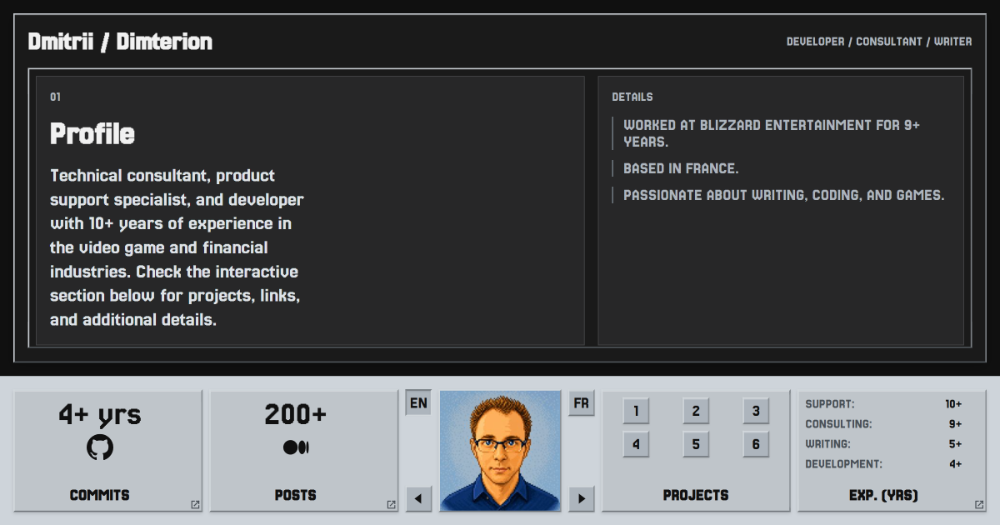
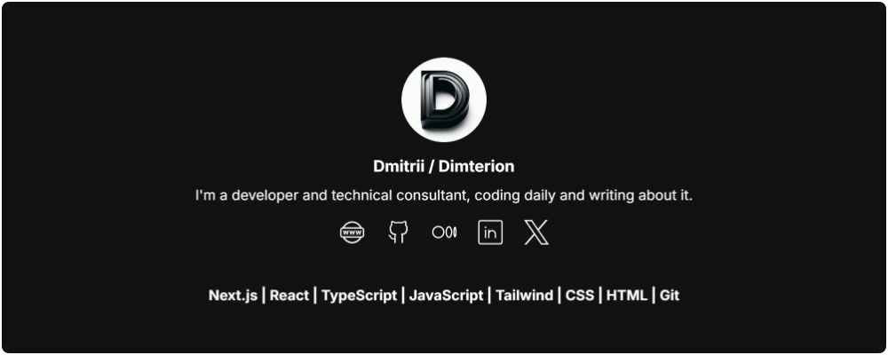

  

# GitHub Profile

HTML / CSS / JavaScript website

## 📋 Table of Contents

- [Introduction](#introduction)
- [Tech Stack](#tech-stack)
- [Live Version](#live-version)
- [Contact Info](#contact-info)

## 🔎 Introduction

GitHub Profile is a website displaying my projects and contact information.

## ⚙️ Tech Stack

- HTML
- CSS
- JavaScript
- Prettier
- GitHub Pages

## 🔗 Live Version

### [GitHub Profile](https://dimterion.github.io/)

## 📫 Contact info

### Bio Link ⬇️

**Note:** Ctrl+Click (Windows/Linux) or Cmd+Click (macOS) the image to open link in a new tab.
